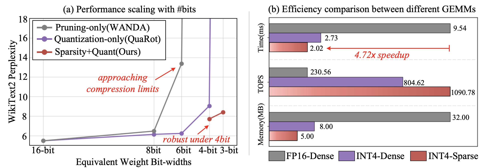
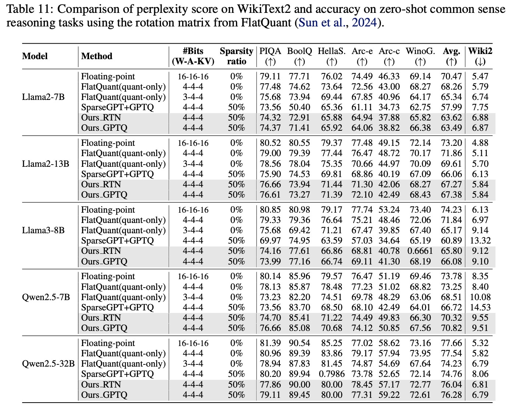
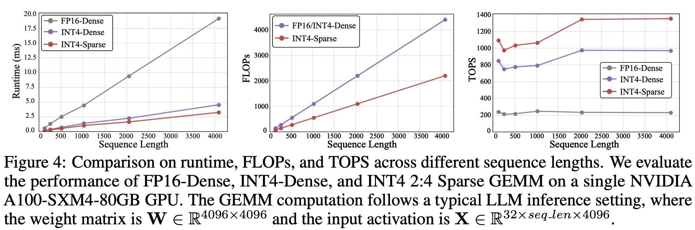
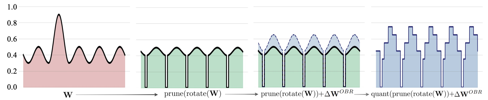

<div align="center">

<h2>
Optimal Brain Restoration for Joint Quantization and Sparsification of LLMs 
</h2>

[Hang Guo](https://csguoh.github.io/), [Yawei Li](https://yaweili.bitbucket.io/), [Luca Benini](https://ee.ethz.ch/the-department/people-a-z/person-detail.luca-benini.html)


[](http://arxiv.org/abs/2509.11177)
[](https://huggingface.co/collections/HangGuo/optimal-brain-resotration-689863c8687d3aeed27f9a96)

</div>

> **Abstract:**  
Recent advances in Large Language Model (LLM) compression, such as quantization and pruning, have achieved notable success. However, as these techniques gradually approach their respective limits, relying on a single method for further compression has become increasingly challenging. In this work, we explore an alternative solution by combining quantization and sparsity. This joint approach, though promising, introduces new difficulties due to the inherently conflicting requirements on weight distributions: quantization favors compact ranges, while pruning benefits from high variance. To attack this problem, we propose Optimal Brain Restoration (OBR), a general and training-free framework that aligns pruning and quantization by error compensation between both. OBR minimizes performance degradation on downstream tasks by building on a second-order Hessian objective, which is then reformulated into a tractable problem through surrogate approximation and ultimately reaches a closed-form solution via group error compensation. Experiments show that OBR enables aggressive W4A4KV4 quantization with 50% sparsity on existing LLMs, and delivers up to 4.72x speedup and 6.4x memory reduction compared to the FP16-dense baseline.

⭐If this work is helpful for you, please help star this repo. Thanks!🤗

## ✨ Highlights

1️⃣ **The First to Enable W4A4KV4+50% Sparsity LLMs** 


<details>
<summary>Performance under different bit-widths and efficiency comparison (click to expand)</summary>

<p align="center">
    
</p>
</details>


2️⃣ **Strong Performance on WikiText Perplexity and Zero-shot Evaluation**

<details>
<summary>Quantitative Results on the WikiText perplexity and zero-shot accuracy (click to expand)</summary>

<p align="center">
    
</p>
</details>


3️⃣ **Promising Efficiency again Dense INT4  Baselines** 

<details>
<summary>Comparison on Runtime, FLOPs, and TOPS (click to expand)</summary>

<p align="center">
    
</p>
</details>

## 📑 Contents

- [News](#news)
- [TODO](#todo)
- [Pipeline](#pipeline)
- [Core Algorithm](#core_algorithm)
- [Get Started](#get_started)
- [Citation](#cite)

## <a name="news"></a> 🆕 News

- **2025-09-16:** arXiv paper available.
- **2025-09-16:** This repo is released and we have open sourced all our code and weights!


## <a name="todo"></a> ☑️ TODO

- [x] arXiv version available 
- [x] Release code
- [ ] Further improvements


## <a name="pipeline"></a> 👀 Pipeline

The core idea of our **Optimal Brain Restoration (OBR)**  is to intervene between pruning and quantization operators by computing an optimal compensation, thereby reconciling the conflicting requirements of these two methods on weight distributions.


<p align="center">
    
</p>


##  <a name="core_algorithm"></a> 🎈Core Algorithm

For learning purpose, one may quickly locate the core code of our OBR algo. in [this line]()). Since our OBR is a general technology, other LLMs also potentially apply.


##  <a name="get_started"></a> 💪Get Started

Since our OBR works on rotated LLM weights, we includes existing state-of-the-art rotation scheme including QuaRot, SpinQuant, and FlatQuant. Therefore, it is necessary to download the rotation matrix first before using our OBR.


### OBR for QuaRot
Here, we use the Llama2-7B as an example.

First cd into the Infinity folder

```
cd ./QuaRot
```

For the  QuaRot method, since the Hadamard rotation is not learnable, we do not need to download the matrix and the rotation can be on-line generated in the code.

One can use the following command line to get a W4A4KV4+50% unstructured sparse Llama2-7B model.

```
CUDA_VISIBLE_DEVICES=0,1,2,3 python main.py  --rotate --a_bits 4 --v_bits 4 --k_bits 4 --w_bits 4 --w_clip --ppl_eval
```

We also prepared the OBR-caliberated model in our [HF repo](https://huggingface.co/collections/HangGuo/optimal-brain-resotration-689863c8687d3aeed27f9a96). So one can also directly reproduce the performance reported in the paper by adding the `--load_qmodel_path HangGuo/Llama2-7B-QuaRot-OBR-GPTQ-W4A4KV4S50`. 

### OBR for SpinQuant

Here, we use the Llama2-7B as an example.

First cd into the Infinity folder

```
cd ./SpinQuant
```

Download the rotation matrix released by the official SpinQuant repo [here](https://drive.google.com/drive/folders/1nV9juzE6_OHr10y6Ke5KCyOiGqDr0srX). Please be read [this note](https://github.com/facebookresearch/SpinQuant?tab=readme-ov-file#note) from SpinQuant authors to make sure a correct version before your downloading. 

Then one can implement our OBR-GPTQ algo. using this command line. This will result in the W4A4KV4 + 50% unstructured sparsity Llama2-7B model. 

```
python main.py --input_model meta-llama/Llama-2-7b-hf --do_train False --do_eval True --per_device_eval_batch_size 4 --model_max_length 2048 --fp16 False --bf16 True --save_safetensors False --w_bits 4 --a_bits 4 --k_bits 4 --v_bits 4 --w_clip --a_asym --k_asym --v_asym --k_groupsize 128 --v_groupsize 128 --rotate --optimized_rotation_path /data/guohang/OBR/SpinQuant/rotations/GPTQ/llama27b/R.bin --ppl_eval
```

We also prepared the OBR-caliberated model in our [HF repo](https://huggingface.co/collections/HangGuo/optimal-brain-resotration-689863c8687d3aeed27f9a96). So one can also directly reproduce the performance reported in the paper by adding the `--load_qmodel_path <HF_repo_name>`. 

### OBR for FlatQuant

Here, we use the Qwen2.5-Instruct-7B as an example.

**IMPORTANT:**  For experiments with Qwen2.5 series, please change the `transformers` library via `pip install transformers==4.45.0`, since an old version has no implementation of QWen2.5 model. 


First cd into the Infinity folder

```
cd ./FlatQuant
```

Download the official rotation matrix [here](https://huggingface.co/ruikangliu/FlatQuant/tree/main/qwen-2.5-instruct-7b/w4a4) from the FlatQuant repo and put it in your local  path. 

Run the following line to generate a W4A4KV4+50% unstructured sparse Qwen2.5-7B model.

```
python main.py --model Qwen/Qwen2.5-7B-Instruct --w_bits 4 --a_bits 4 --k_bits 4 --k_asym --k_groupsize 128 --v_bits 4 --v_asym --v_groupsize 128 --cali_bsz 4 --epoch 15 --flat_lr 5e-3 --lwc --lac --cali_trans --add_diag --output_dir ./outputs --save_matrix --ppl_eval --reload_matrix --matrix_path /data2/guohang/pretrained/flatquant_rotation
```

We also prepared the OBR-caliberated model in our [HF repo](https://huggingface.co/collections/HangGuo/optimal-brain-resotration-689863c8687d3aeed27f9a96). So one can also directly reproduce the performance reported in the paper by adding the `--load_qmodel_path HangGuo/QWen2.5-7B-FlatQuant-OBR-GPTQ-W4A4KV4S50`. 

### Key Args

For compatibility, we keep the name of  OBR-related args the same in all rotation frameworks. Basically, the meaning of some key args are as follows.


- `obr_rtn`: use the OBR_RTN algorithm, default False (i.e. use the OBR_GPTQ).

- `obr_alpha`: the group partition ratio for Retain set and Eviction Set in OBR_GPTQ algorithm, default 0.5.

- `sparsity_ratio`: the sparse ratio in pruning, default 0.5.

- `prune_n`: the N in N:M semi-structured pruning, default 0 (i.e. use unstructured pruning)


- `prune_m`: the M in N:M semi-structured pruning, default 0 (i.e. use unstructured pruning)


- `ppl_eval` : whether to evaluate the perplexity on WikiText2.

- `lm_eval` : whether to evaluate the 0-shot accuracy.


## <a name="cite"></a> 🥰 Citation

Please cite us if our work is useful for your research.

```

```

## License

Since this work is  based on the previous works including [QuaRot](https://github.com/spcl/QuaRot), [SpinQuant](https://github.com/facebookresearch/SpinQuant), and [FlatQuant](https://github.com/ruikangliu/FlatQuant)., users should follow the license of the corresponding backbone models like **QuaRot(Apache2.0 License)**, **SpinQuant(CC-BY-NC 4.0)** and **FlatQuant(MIT License)**.


## Contact

If you have any questions, feel free to contact me at cshguo@gmail.com


